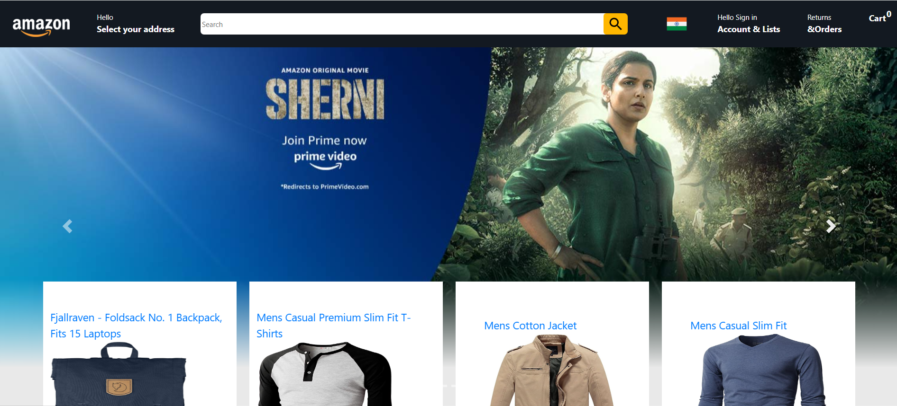

### Amazon Clone 

This is a front-end clone of the Amazon website built with React. It mimics key features such as product listings, search functionality, and a shopping cart. The application is fully responsive, designed for both desktop and mobile screens, and showcases how to structure a simple e-commerce site.

### Features:

Product Listings: Display a list of products with images, titles, and prices.
Search Bar: Users can search products by keyword.
Shopping Cart: Add, remove, and view products in the shopping cart.
Responsive Design: Fully responsive layout using Flexbox and CSS Grid.
Product Details Page: View product information and add to cart.
React Router: Implemented routing for multiple pages (Home, Cart, Product Details).
State Management: Uses React's built-in useState and useContext for managing cart state.
Technologies Used
React.js – A JavaScript library for building user interfaces.
React Router – For navigating between pages.
CSS/Styled-Components – For styling the components and responsive design.
React Context API – For global state management (cart, user data, etc.).
Axios (optional) – For making HTTP requests (e.g., fetching products from an API).
React Icons – For using various icons (e.g., for the cart, search).

### Technologies Used:

React.js – A JavaScript library for building user interfaces.
React Router – For navigating between pages.
CSS/Styled-Components – For styling the components and responsive design.
React Context API – For global state management (cart, user data, etc.).
Axios (optional) – For making HTTP requests (e.g., fetching products from an API).
React Icons – For using various icons (e.g., for the cart, search).

### To run this project locally, follow these steps:

1) Prerequisites
  Node.js (latest LTS version)
  npm (comes with Node.js)

2) Clone the Repository

3) Install Dependencies
  npm install

4) Run the Development Server
  npm start

### Landing page

